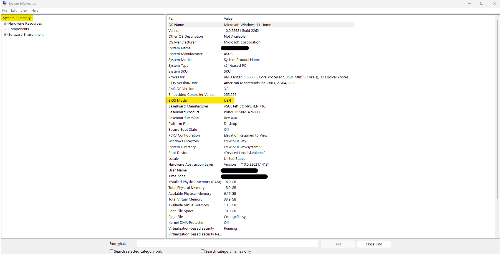

# _ABTutorStopper_

# End User License Agreement
1. This software and instructions are provided as is and are licensed under MIT meaning I (KablammoMan) am not responsible for any legal trouble that you get in
2. Nobody can not get me (KablammoMan) in trouble (infringements, detentions, suspensions, expulsions, etc...) for someone else using these instructions and programs to stop ABTutor
3. By using these instructions and software, you automatically agree to the EULA

# NOTES:
- All the below methods have only been tested on Windows machines, if you institution uses Apple Computers and Products, then firstly, your institution is (respectfully coming from a Windows and Linux Lover/Nerd) RETARDED, and secondly, only some of the below methods will work.

# Methods (A = Requires Administrator Privileges, F = Free, C = Requires External Computer)
**METHOD 1 - UNINSTALLATION - 4.5/10 Complexity - Most Reliable Solution (AF)**
1. Open Control Panel
2. Select "Uninstall a Program"
3. Select "AB Tutor" OR "AB Tutor Maintainer". If both of these show up, do steps 4-6 for both.
4. Click the "Uninstall" button
5. If a UAC (User Access Control) box pops up, select "Yes"
6. Follow the prompts to uninstall AB Tutor. If it asks you whether you want to proceed with the uninstallation, select "Yes"
7. AB Tutor is now uninstalled

**METHOD 2 - SERVER DISCONNECTION - 1/10 Complexity - Easiest Solution (F)**
1. Disconnect from any Wi-Fi networks you are connected to. This includes hotspots.
2. AB Tutor can no longer contact their servers due to lack of internet, stopping details from being sent to the teacher/supervisor.

**METHOD 3 - THE FIREWALL - 6/10 Complexity - Most Reliable without Uninstallation (AF)**
1. Open 'Windows Defender Firewall with Advanced Security'
2. Click 'Outbound Rules' on the left
3. Click 'New Rule' on the Right
4. Select 'Port' in the box that opens up and then click 'Next'
5. Make sure that 'TCP' and 'Specific Remote Ports' are selected
6. Type 5151 into the box and click 'Next'
7. Make sure that 'Block the connection' is selected and click 'Next'
8. Make sure that all checkboxes are checked ('Domain', 'Private' and 'Public')
9. Call it something you will remember (e.g. 'ABStop') and click finish
10. Changes will take effect immediately
11. If you want to enable AB Tutor, right-click the rule and click 'Disable Rule'

**METHOD 4 - SOFTWARE - 3/10 Complexity - Best for Transporting to Other Computers (AF)**
1. Download `start.bat` and `stop.bat`
2. Use each one for its official use
3. You must run these as an administrator for them to work

**METHOD 5 - USB WINDOWS INSTALL - 10/10 Complexity - For those without Admin that can afford to spend a bit of $(C)**
1. Purchase a 64-128GB USB Drive (I recommend these: [64GB Drive](https://www.amazon.com.au/dp/B077VYCV37/) | [128GB Drive](https://www.amazon.com.au/dp/B07855LJ99/))
2. Download Portable Rufus (`rufus-<version>p.exe` NOT `rufus-<version>.exe`) from https://rufus.ie/en/ onto an External Computer
3. Download the Windows ISO also on the external computer ([Windows 10](https://www.microsoft.com/en/software-download/windows10) | [Windows 11](https://www.microsoft.com/en/software-download/windows11)). This requires you to change your user agent on the browser to not be windows in order to trick the Microsoft Website into just giving you the option to download the iso, rather than downloading the windows media creator thingy. This can be done by installing a browser extension (I recommend 'User-Agent Switcher and Manager' ([Chrome Webstore](https://chrome.google.com/webstore/detail/user-agent-switcher-and-m/bhchdcejhohfmigjafbampogmaanbfkg) | [Mozilla Addons](https://addons.mozilla.org/en-US/firefox/addon/user-agent-string-switcher/))
4. Plug in the USB you bought and open `rufus-<version>p.exe`
5. Select the USB Drive in the 'Device' prompt and select the Windows ISO you downloaded in the 'Boot selection' prompt
6. **IMPORTANT:** Make sure to select 'Windows To Go' under the image option prompt
7. Next, 'Partition scheme' and 'Target system'. Go onto the computer that you want to disable AB Tutor on and open 'System Information'. Look for 'BIOS Mode' in the 'System Summary' tab. 
If it says UEFI, choose the 'GPT' and 'UEFI (non CSM)' for your partition scheme and target system.  
If it says something else (I've personally never seen something else before), use 'MBR' and 'BIOS or UEFI' for your partition scheme and target system.  
If this screenshot was from the computer that had AB Tutor installed, I would choose 'GPT' and 'UEFI (non CSM)'
8. Choose the volume label if you want, and make sure the 'File system' says 'NTFS' and the 'Cluster size' option ends with '(Default)'
9. Click 'START' at the bottom of the rufus prompt
10. Select the version of Windows 10 (or Windows 11) on the box that opens up. 